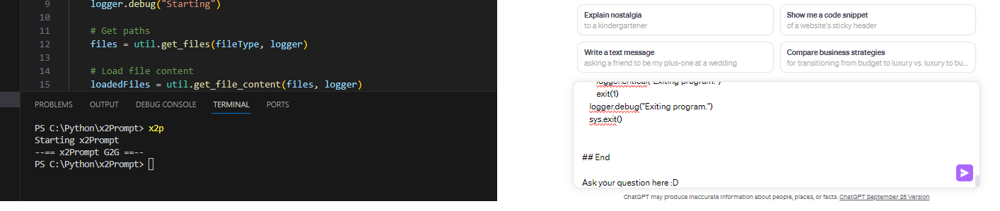

# x2Prompt Project

The `x2Prompt` project is aimed at creating prompts for a ChatGPT by copying the contents and name of a specified files to the clipboard. The project summarizes Python scripts using the OpenAI API and estimates token usage to manage the summary performance based on a set threshold. The summarization is performed only if the token usage exceeds a specified percentage.

## Installation
Download the project and add it to the Windows environment system PATHS.
Edit the x2p.bat file to include the full path to x2Prompt.py.
Type x2p in your terminal when in your project’s directory. 

## About the Author 
 I am not a developer, I am lazy. Hence the script and the format and layout of said script. Lazception.
 Please do not request modifications or submit PR's. Fork it and make it your own!
 ... so I can download your better version later.

## Compatibility and Testing
This script has been developed and tested on Microsoft Windows. I would guess the clipboard function would need to be modified for Linux but I have not
tested that.

## Project Structure

### Files:
1. **config.py** - Contains global configuration variables for the project.
2. **local_config.py** - Contains local configuration variables, and overrides global configurations if necessary.
3. **x2Prompt.py** - Main driver script of the project.
4. **x2Prompt_util.py** - Utility script containing various helper functions used by the main script.
5. **x2Prompt.log** - Log file to track script execution and issues (created after running the script).

### Main Script:
- **x2Prompt.py**:
  - `main()` - Main function which orchestrates the execution of helper functions from `x2Prompt_util.py`.
  - `if __name__ == "__main__":` - Ensures the main function is called when script is run as the main module.

### Utility Script:
- **x2Prompt_util.py**:
  - `summarize_scripts()` - Summarizes the contents of provided files using OpenAI API.
  - `estimate_tokens()` - Estimates the token count for a given text.
  - `send_to_clipboard()` - Sends the built prompt to the clipboard.
  - `build_prompt()` - Constructs the prompt to be loaded into the clipboard.
  - `get_file_content()` - Retrieves the contents of the files in UTF-8.
  - `get_files()` - Retrieves files that match a specified filter.
  - `setup_logs()` - Sets up logging for tracking script execution and issues.
  - `exit_program()` - Logs error messages and exits the program.

## Configuration:

- **Global Configuration** (config.py):
  - Logging, file type, token encoding, OpenAI API, and summary request configurations.

- **Local Configuration** (local_config.py):
  - Overrides global configurations if necessary.

## Usage:
1. Ensure you have the necessary libraries installed (`logging`, `pyperclip`, `tiktoken`, `openai`, `tqdm`).
2. Update `config.py` or `local_config.py` with your specific configurations including OpenAI API key.
3. Run `x2Prompt.py` to execute the script.
4. Check `x2Prompt.log` for logs regarding the script execution.

## Summary Performance:
- The script estimates the token count before and after summarization to check if summarization is required based on a specified threshold (`tokenMaxPercent`).
- Summarization is performed using OpenAI's GPT-3.5-turbo (or GPT-4 if available) to summarize the scripts.

## Logging:
- Logging is set up to track the execution of the script and log any errors encountered during the process.

## Output:
- The final prompt is copied to the clipboard ready to be used for ChatGPT.
- Progress is displayed using a tqdm progress bar during file summarization.

## Error Handling:
- Any errors encountered during the execution are logged to `x2Prompt.log` and the script is exited safely using the `exit_program()` function.

---

This README provides a comprehensive overview of the `x2Prompt` project, its structure, usage, and functionality. For further details, you can refer to the comments within the code or the log file generated during script execution.
